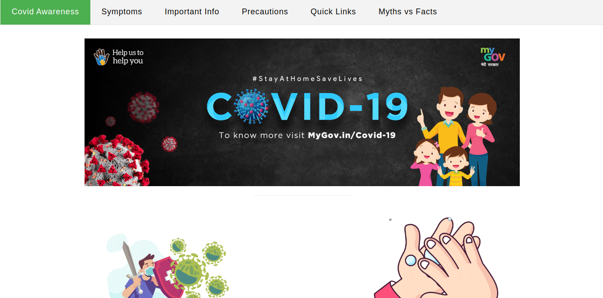

# Covid_Awareness_Website

The aim was to reduce the virus communication in society, dissemination of crucial information, providing proper healthcare and to minimize social and economical loss. WHO also focused on establishing an easy and effective diagnostic system to prevent infection.

## How to run
1. Download this repository and extract the file
2. Run 'index.html' file in browser

## Screenshot

